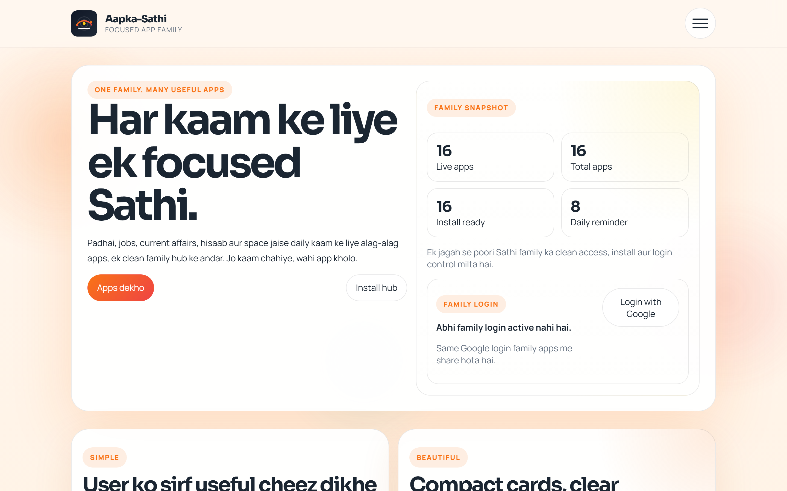

# Aapka-Sathi

## About

Family hub for every Sathi app, with the live registry, standards, and expansion system in one place.

- Live website: https://snakeeye-sudo.github.io/Aapka-Sathi/
- Family hub: https://snakeeye-sudo.github.io/Aapka-Sathi/
- GitHub repo: https://github.com/SnakeEye-sudo/Aapka-Sathi
- Tags: sathi-family, github-pages, pwa, hindi-app, family-hub, ecosystem

## Family Product Rule

- Every future Sathi family app must preserve the **Pariksha-Sathi level product feel** as the family standard.
- New apps must be designed **mobile-app-first**, not website-first.
- The experience should feel like a focused installable app with a clear task flow, app shell, and touch-friendly interaction.
- Main app screens should avoid website-style clutter such as footer-heavy About/Resources/Privacy blocks.
- If there is any conflict between a generic website layout and an app-like product experience, the **app-like experience wins**.

<!-- hero-app:start -->
## Hero App

**Aapka-Sathi** is the hero app of the ecosystem. It is the main family hub where users can discover every Sathi app, track which apps are installed, and manage manual family backup and restore from one place.

## Family Apps

-  [Ank Sathi](https://snakeeye-sudo.github.io/Ank-Sathi/)
-  [Antariksh Sathi](https://snakeeye-sudo.github.io/Antariksh-Sathi/)
-  [Dastavez Sathi](https://snakeeye-sudo.github.io/Dastavez-Sathi/)
-  [Dhyan Sathi](https://snakeeye-sudo.github.io/Dhyan-Sathi/)
-  [Ganit Sathi](https://snakeeye-sudo.github.io/Ganit-Sathi/)
-  [Hisaab Sathi](https://snakeeye-sudo.github.io/Hisaab-Sathi/)
-  [Jal Sathi](https://snakeeye-sudo.github.io/Jal-Sathi/)
-  [Khel Sathi](https://snakeeye-sudo.github.io/Khel-Sathi/)
-  [Mann Sathi](https://snakeeye-sudo.github.io/Mann-Sathi/)
-  [Mausam Sathi](https://snakeeye-sudo.github.io/Mausam-Sathi/)
-  [Paltu Sathi](https://snakeeye-sudo.github.io/Paltu-Sathi/)
-  [Panchang Sathi](https://snakeeye-sudo.github.io/Panchang-Sathi/)
-  [Pariksha Sathi](https://snakeeye-sudo.github.io/pariksha-sathi/)
-  [Rozgar Sathi](https://snakeeye-sudo.github.io/rozgar-sathi/)
-  [Samachar Sathi](https://snakeeye-sudo.github.io/Samachar-Sathi/)
-  [Sanket Sathi](https://snakeeye-sudo.github.io/Sanket-Sathi/)
-  [Sikka Sathi](https://snakeeye-sudo.github.io/Sikka-Sathi/)

<!-- hero-app:end -->
## Creator

Built and originally created by **Er. Sangam Krishna** ([SnakeEye-sudo](https://github.com/SnakeEye-sudo)).

## Credit And Ownership

- Original concept, product direction, branding, and primary implementation credit stays with **Er. Sangam Krishna**.
- Contributions, fixes, and improvements are welcome, but original creator credit must remain intact in the repository, README, NOTICE file, and public metadata.
- Do not remove, replace, or hide the original creator attribution from copies, forks, distributions, demos, or derivative work.

## License

This repository uses the **MIT License** with a required **NOTICE** file.
That means collaboration is allowed, but copyright and attribution notices must stay preserved.
See [LICENSE](LICENSE), [NOTICE](NOTICE), and [CONTRIBUTING.md](CONTRIBUTING.md).

